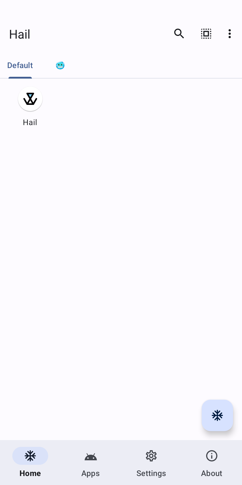
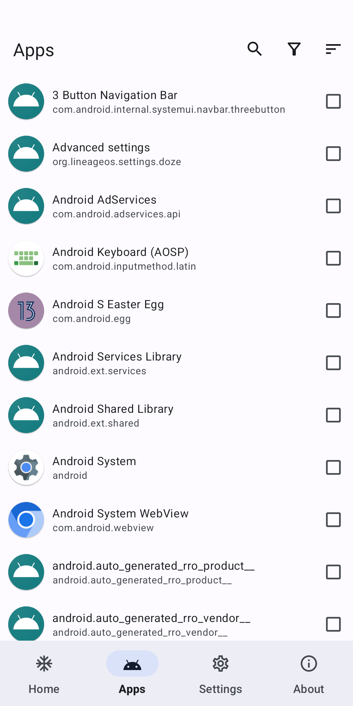

# Hail 

Hail is a free-as-in-freedom software to freeze Android
apps.

[](https://github.com/rahaaatul/Hail/actions)
[](https://hosted.weblate.org/engage/hail/)
[](https://github.com/rahaaatul/Hail/releases)
[](LICENSE)

  

## Freeze

Freeze is a word that describes the action of **blocking (immediately stopping) apps when they are not needed/in-use (
on-demand request)** which in turn helps the device to cut down on the usage of RAM and save power. Users can also
unfreeze them to revert to their original state.

In general, "freeze" means disable, but also Hail can "freeze" apps by hiding and suspending them.

### Disable

Disabled apps will not be shown in the launcher and will be shown as "Disabled" in the installed apps list. Enable them
to revert the action.

### Hide

Hidden apps will not be shown in the launcher and in the installed apps list. Unhide them to revert the
action.

> While in this state, which is almost like an uninstalled state, the package will be unavailable, however, the
> application data and the actual package file will not be removed from the device.

### Suspend (Android 7.0+)

Suspended apps will have their icons shown in grayscale within the device's launcher. Unsuspend them to revert the
action.

> While in this state, the application's notifications will be hidden, any of its started activities will be stopped and
> it will not be able to show toasts, dialogs or even play audio. When the user tries to launch a suspended app, the
> system will, instead, show a dialog to the user informing them that they cannot use this app while it is suspended.

Suspend only prevents the user from interacting with the app, it does **NOT** prevent the app from running in the
background.

## Working mode

**Any app that has been frozen on Hail will need to be unfrozen by the same working mode.**

1. For devices supporting wireless debugging (Android 11+) or rooted devices, `Shizuku` is recommended.

2. For rooted devices, `Root` is an alternative. **It is slower.**

In Root mode, Hail starts a cached libsu shell in the background when the app process starts. This moves the root
authorization delay away from the first freeze or unfreeze action while keeping the UI responsive. The shell is reused
for all Root operations in that process, including operations on different apps.

If Root mode is not selected, no root shell is started. Switching away from Root mode closes the cached shell. If root
authorization is denied or the shell exits unexpectedly, the failed shell is discarded and the next Root operation
attempts to acquire a new one. A new shell is also acquired after Hail is restarted.

| Privilege                                                                                         | Force Stop | Disable | Hide | Suspend | Uninstall/Reinstall (System Apps) |
|---------------------------------------------------------------------------------------------------|------------|---------|------|---------|-----------------------------------|
| Root                                                                                              | ✓          | ✓       | ✓    | ✓       | ✓                                 |
| Device Owner                                                                                      | ✗          | ✗       | ✓    | ✓       | ✗                                 |
| Privileged System App                                                                             | ✓          | ✓       | ✗    | ✗       | ✗                                 |
| [Shizuku](https://github.com/RikkaApps/Shizuku) (root)/[Sui](https://github.com/RikkaApps/Sui)    | ✓          | ✓       | ✓    | ✓       | ✓                                 |
| [Shizuku](https://github.com/RikkaApps/Shizuku) (adb)                                             | ✓          | ✓       | ✗    | ✓       | ✓                                 |
| [Dhizuku](https://github.com/iamr0s/Dhizuku)                                                      | ✗          | ✗       | ✓    | ✓       | ✗                                 |
| [Island](https://github.com/oasisfeng/island)/[Insular](https://gitlab.com/secure-system/Insular) | ✗          | ✗       | ✓    | ✓       | ✗                                 |

### Device Owner

**You must remove Hail as a device owner before you can uninstall it**

#### Set device owner by adb

[Android Debug Bridge (adb) Guide](https://developer.android.com/studio/command-line/adb)

[Download Android SDK Platform-Tools](https://developer.android.com/studio/releases/platform-tools)

Issue adb command:

```shell
adb shell dpm set-device-owner com.aistra.hail/.receiver.DeviceAdminReceiver
```

In response, adb prints this message if device owner has been successfully set:

```
Success: Device owner set to package com.aistra.hail. Active admin set to component {com.aistra.hail/com.aistra.hail.receiver.DeviceAdminReceiver}
```

Search the message by search engine otherwise.

#### Remove device owner

Settings > Remove Device Owner

### Privileged System App

The following privapp-permissions is required:

```xml
<?xml version="1.0" encoding="utf-8"?>
<permissions>
    <privapp-permissions package="com.aistra.hail">
        <permission name="android.permission.PACKAGE_USAGE_STATS"/>
        <permission name="android.permission.FORCE_STOP_PACKAGES"/>
        <permission name="android.permission.CHANGE_COMPONENT_ENABLED_STATE"/>
        <permission name="android.permission.MANAGE_APP_OPS_MODES"/>
    </privapp-permissions>
</permissions>
```

To use this mode, you should install Hail as a privileged system app.

The recommended approach is to import Hail when building your ROM, here's an example for `Android.bp`:

```bp
android_app_import {
    name: "Hail",
    apk: "Hail.apk",
    privileged: true,

    dex_preopt: {
        enabled: false,
    },
    presigned: true,
    preprocessed: true,

    required: ["privapp-permissions_com.aistra.hail.xml"]
}

prebuilt_etc {
    name: "privapp-permissions_com.aistra.hail.xml",
    src: "privapp-permissions.xml",
    sub_dir: "permissions",
}
```

## Revert

### By adb

Replace com.package.name to the package name of target app.

```shell
# Enable app
adb shell pm enable com.package.name
# Unhide app (root required)
adb shell su -c pm unhide com.package.name
# Unsuspend app
adb shell pm unsuspend com.package.name
```

### Modify file

Access `/data/system/users/0/package-restrictions.xml`, this file stores the restrictions about apps. You can modify,
rename or just delete it.

- Enable app: Modify the value of `enabled` from 2 (DISABLED) or 3 (DISABLED_USER) to 1 (ENABLED)

- Unhide app: Modify the value of `hidden` from true to false

- Unsuspend app: Modify the value of `suspended` from true to false

### Wipe data by recovery

**None of my business :(**

## API

```shell
adb shell am start -a action -e key value
```

`action` can be one of the following constants:

- `com.aistra.hail.action.LAUNCH`: Unfreeze and launch target app. If it is unfrozen, it will launch directly.
  `key="package"` `value="com.package.name"`

- `com.aistra.hail.action.FREEZE`: Freeze target app. It must be checked at Home. `key="package"`
  `value="com.package.name"`

- `com.aistra.hail.action.UNFREEZE`: Unfreeze target app. `key="package"` `value="com.package.name"`

- `com.aistra.hail.action.FREEZE_TAG`: Freeze all non-whitelisted apps in the target tag. `key="tag"` `value="Tag name"`

- `com.aistra.hail.action.UNFREEZE_TAG`: Unfreeze all apps in the target tag. `key="tag"` `value="Tag name"`

- `com.aistra.hail.action.FREEZE_ALL`: Freeze all apps at Home. `extra` is not necessary.

- `com.aistra.hail.action.UNFREEZE_ALL`: Unfreeze all apps at Home. `extra` is not necessary.

- `com.aistra.hail.action.FREEZE_NON_WHITELISTED`: Freeze all non-whitelisted apps at Home. `extra` is not necessary.

- `com.aistra.hail.action.FREEZE_AUTO`: Auto freeze apps at Home. `extra` is not necessary.

- `com.aistra.hail.action.LOCK`: Lock screen. `extra` is not necessary.

- `com.aistra.hail.action.LOCK_FREEZE`: Freeze all apps at Home and lock screen. `extra` is not necessary.

or use following `schema`:

- `hail://launch?package=xxx`

- `hail://freeze?package=xxx`

- `hail://unfreeze?package=xxx`

- `hail://freeze_tag?tag=xxx`

- `hail://unfreeze_tag?tag=xxx`

- `hail://freeze_all`

- `hail://unfreeze_all`

- `hail://freeze_non_whitelisted`

- `hail://freeze_auto`

- `hail://lock`

- `hail://lock_freeze`

## Release

Releases are orchestrated through [Fastlane](https://fastlane.tools) lanes. Gradle remains the build
and signing source of truth; GitHub Actions remains the trigger, permission, artifact, and release
host. Fastlane does not duplicate Telegram or signing logic — it delegates to the existing
`.github/scripts/*.sh` helpers.

### Lanes

| Lane | Description |
|------|-------------|
| `metadata_check` | Validates store metadata (`fastlane/metadata/android/{en-US,zh-CN}/*`). Fails on missing title, description, icon, or screenshots. |
| `build_debug` | Builds an unsigned debug APK via `./gradlew assembleDebug`. |
| `build_pr` | Builds an unsigned PR APK via `./gradlew assemblePr`. Requires `--pr_number N`. |
| `build_release` | Builds a signed release APK via `./gradlew assembleRelease`. Optional `--release_type release|pre-release`. |
| `github_release` | Creates or updates a GitHub Release. Fails closed if the tag already exists with mismatched provenance (asset name/size). |
| `telegram_notify` | Sends the built artifact to Telegram. Dry-runs when `TG_TOKEN` is unset; failures abort the build. |
| `release` | Full orchestration: `metadata_check` → `build_release` → `github_release` → `telegram_notify`. |

### Run locally

Install Ruby 3.3.6 and the Fastlane dependencies, then run a lane:

```shell
# Install dependencies (once)
cd fastlane && bundle install

# Validate store metadata
bundle exec fastlane metadata_check

# Build a debug APK
bundle exec fastlane build_debug

# Build a PR APK for PR #42
bundle exec fastlane build_pr pr_number:42

# Build a signed release APK (requires the KEYSTORE* environment variables)
bundle exec fastlane build_release release_type:release

# Full release + GitHub Release + Telegram notification
bundle exec fastlane release build_type:release tag:v1.11.5 repository:rahaaatul/Hail api_token:$GH_TOKEN notify:true
```

Lane options are passed as `key:value` pairs (e.g. `fastlane build_pr pr_number:42`).

### CI integration

Builds are triggered by the `Build` workflow (`.github/workflows/build.yml`), which runs on
`pull_request` and `workflow_dispatch` (choice: `debug`, `release`, `pre-release`).

- Release builds require the `KEYSTORE`, `KEYSTORE_PASSWORD`, `KEYSTORE_ALIAS`, and
  `KEYSTORE_ALIAS_PASSWORD` environment variables. The `build_release` lane creates them
  fail-closed (any missing variable aborts the build) and keeps the keystore in a `mktemp`
  directory; it writes a mode-`0600` `signing.properties` at the repository root — where
  `app/build.gradle.kts` looks for it — and deletes it again once the build finishes. The
  keystore never touches persistent storage, and `signing.properties` is gitignored.
- Release builds are **fail-closed** in Gradle as well: `assembleRelease`/`bundleRelease`
  without a readable `signing.properties` aborts with a `GradleException` instead of silently
  producing an unsigned APK. There is no debug fallback key.
- The `release` lane additionally aborts when `CHANGELOG.md` has no `## [versionName]` entry.
- Telegram notifications use `TG_TOKEN` and `TG_GROUP`. Failures abort the build.
  When `TG_TOKEN` is unset, the upload step dry-runs.
- Debug builds are compressed with 7z (`-mx=9`, >15MB) or zip (`-9`, ≤15MB) before upload.

### Environment variables

| Variable | Required | Purpose |
|----------|----------|---------|
| `TG_TOKEN` | for Telegram | Bot token for `telegram_notify` / `.github/scripts/upload.sh`. |
| `TG_GROUP` | for Telegram | Telegram chat id. |
| `KEYSTORE` | for release builds | Base64-encoded `keystore.jks`. |
| `KEYSTORE_PASSWORD` | for release builds | Keystore password. |
| `KEYSTORE_ALIAS` | for release builds | Key alias. |
| `KEYSTORE_ALIAS_PASSWORD` | for release builds | Key password. |
| `PR_NUMBER` | for `build_pr` | Pull request number; drives the `pr` build type suffix and APK filename. |
| `GH_TOKEN` | for `release` | GitHub token for `github_release` and PR title lookup. |
| `RELEASE_TYPE` | for `build_release` | `release` or `pre-release` (affects filename only). |
| `REPO` | optional | `owner/repo` for commit URLs (default `rahaaatul/Hail`). |

Local release builds work the same way: export the four signing variables (or load them from a
gitignored `secrets.env`) and run the lane. The lane refuses to build a release without them.

## Help Translate

To translate Hail into your language, or to improve an existing translation,
use [Weblate](https://hosted.weblate.org/engage/hail/).

[](https://hosted.weblate.org/engage/hail/)

## License

    Hail - Freeze Android apps
    Copyright (C) 2021-2026 Aistra
    Copyright (C) 2022-2026 Hail contributors

    This program is a free software: you can redistribute it and/or modify
    it under the terms of the GNU General Public License as published by
    the Free Software Foundation, either version 3 of the License, or
    (at your option) any later version.

    This program is distributed in the hope that it will be useful,
    but WITHOUT ANY WARRANTY; without even the implied warranty of
    MERCHANTABILITY or FITNESS FOR A PARTICULAR PURPOSE.  See the
    GNU General Public License for more details.

    You should have received a copy of the GNU General Public License
    along with this program.  If not, see <https://www.gnu.org/licenses/>.
